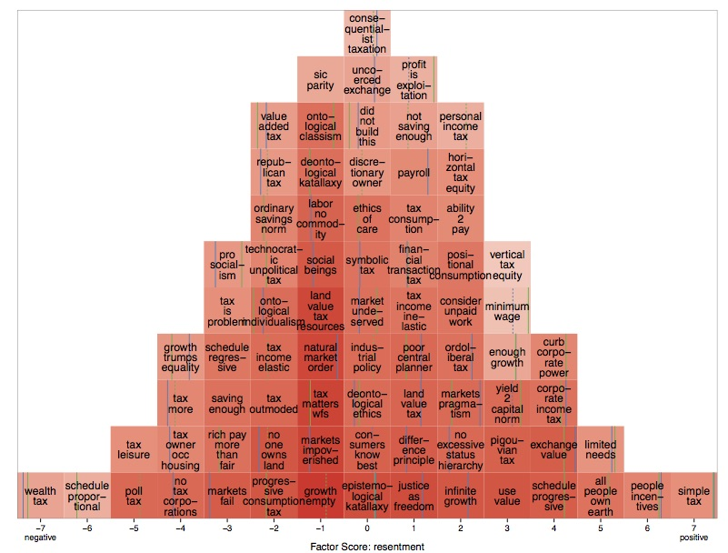

## Extended Abstract

> *"Reaching understanding is the inherent telos of human speech."*
> -- Jürgen Habermas [-@Habermas-1984 : 287]

The way people are working is purportedly changing, yet, amidst all the buzzwords of "Work 2.0", "Industry 4.0" and "Digital Economy", even amongst experts, there is little agreement on just what the future workplace *will* look like, let alone how it *should* look like.
This uncertainty is unsurprising, and unlikely to be resolved.
As Niels Bohr quipped: prediction is very difficult, especially about the future.

Yet, both todays *beliefs* on what the future *will* hold, and *values* about what it *should* bring informs our current decisions, which, in turn, will shape the future.
This is the fundamental feedback loop of human institutions: they mould the human condition, as much as they respond to it [compare @Dawkins1976 @BeckGiddens-1994-aa].

Take for instance, the assertion, that a second machine age is, or *should be*, upon us [@brynjolfsson_second_2014].
We might, as experts or citizens, *believe* that a quantum leap in robotics or artificial intelligence (AI) is just around the corner, or, on the contrary, we might think that "true" AI is an ever receding horizon and that human intuition and context-awareness will remain irreplaceable for some time.
We might also *disagree* about whether such technical progress would be *desirable*.
Some might hope for a day when technologies frees mankind of the tedium of routine labor, leaving us free to pursue nobler, more fulfilling lives.
Others might worry about the inequality, despondence and devaluation such disruption might bring.
Crucially, we will also disagree on how much it even *matters* what we value: some will say that we will (not) be replaced by machines regardless, others will want to politicize the fight for (against) it.
Arguably, progressives and conservatives have fought over little else but this question: Is our future of our own, political making?

Liberal pluralism does not lend itself to *definitive answers* of such sweeping questions, but it offers meaningful dialog.
So too, at a conference on the future of work: In the face of uncertainty and disagreement, we must at least strive for some mutual understanding.

We suggest the Labouratory Q-Mindshare as a rigorous, but open-ended analytical tool to inform and structure such debate at the Labor 4.0 conference.
Participants will be invited to rank-order according to their *beliefs* and *values* a diverse set of short statements, sampled from conference contributions and related literature.
Using a novel application of three-mode principal components analysis (nPCA) [@Kroonenberg-1983, @Tucker-1966] to Q Methodology, several shared, ideal-typical viewpoints on the future of labor along *two* dimensions will be presented for interpretation and discussion.
The analysis will be run in real time at the conference, with summaries and visualizations updating as more people submit responses in a web application publicly accessible by kiosk computer and individual laptops.

Perhaps fittingly for the topic of the conference, the Labouratory Q-Mindshare is enabled by current advances in statistical computing, open source software and powerful visualization, but puts this technology in the service of human subjectivity. 
The technique will allow conference participants to consider holistic, yet rigorous summaries of all other participants' viewpoints in a readily understandable, visual and verbal form.

Predictions are hard, especially self-serving speculation on the value of unproven, flashy  participatory technology, such as the Labouratory Q-Mindshare.
At worst, it will be a mildly stimulating proof-of-concept of an extension of the marginal, but occasionally useful Q Methodology, producing some starters for discussion at the conference.
At best, it will be a small illustration of a kind of fruitful complementarity between humanity and technology that has little to do cyborgs: a *transhumanism of shared subjectivity*.

## Bibliography
